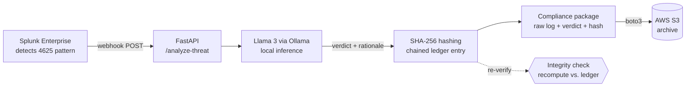

# Cortex-Chain

**AI-assisted SOC triage with tamper-evident archiving.**

Cortex-Chain turns raw Windows failed-logon alerts (Event ID 4625) into a
triage verdict using a **local** Llama 3 model, then archives each verdict with
a SHA-256 integrity hash so any later tampering is detectable. Every capability
claimed below is measured — see [Evaluation](#evaluation).

---

## What it does

- **AI-assisted triage** — a local Llama 3 (8B) instance classifies each 4625
  alert as *brute-force* or *benign* and returns a short rationale.
- **Tamper-evident archiving** — each archived alert gets a SHA-256 digest;
  entries are chained (each hashes the previous), so altering one archived log
  is detectable on re-verification and the break cascades forward.
- **Cloud archiving** — compliance packages (raw log + AI verdict + hash) are
  uploaded to AWS S3 for retention.
- **Runs locally** — analysis uses Ollama on the local network, so alert
  contents never leave the environment for a third-party AI API.

---

## Architecture



**Detection → analysis → hashing → archiving.** Splunk detects a brute-force
pattern and fires a webhook; FastAPI passes the payload to Llama 3; the verdict
and raw log are hashed into a ledger entry; the package is archived to S3. The
ledger can be re-verified at any time to detect tampering.

---

## Tech stack

| Layer | Choice |
|---|---|
| AI engine | Llama 3 (8B) via Ollama |
| Backend | Python 3.11, FastAPI |
| SIEM integration | Splunk Enterprise (webhook) |
| Cloud | AWS S3 (+ IAM), boto3 |
| Integrity | SHA-256 hash chain |

---

## Evaluation

All three capabilities are measured with a self-contained harness in
[`eval/`](eval/). It runs fully offline (no AWS required).

### Triage accuracy

30 labeled synthetic 4625 alert scenarios (15 genuine brute-force, 15 benign),
including two deliberately hard cases: a low-and-slow attack (`case_07`) and a
short-window benign typo (`case_22`). Each is run through Llama 3 and its
verdict compared to the ground-truth label.

| Metric | Result |
|---|---|
| Correctly classified | **29 / 30 (96.7%)** |
| Precision (brute-force) | 100.0% |
| Recall (brute-force) | 93.3% |
| F1 | 96.6% |
| Verdict parse rate | 96.7% |

Confusion matrix (rows = truth, columns = predicted):

| | pred brute-force | pred benign |
|---|---|---|
| **truth brute-force** | 14 (TP) | 1 (FN) |
| **truth benign** | 0 (FP) | 15 (TN) |

Both hard cases were classified correctly. The single miss (`case_04`) was a
**parse failure**, not a wrong verdict: the model's reply didn't include the
required `VERDICT:` line in a machine-readable form, so it was scored as
incorrect. Reported as-is rather than tuned away, for honesty.

### Triage latency

Measured prompt-in to verdict-out, per alert, on **CPU-only hardware** (8B
model, no GPU):

| Metric | Result |
|---|---|
| Median | 34.9s |
| Mean | 41.3s |
| p95 | 72.6s |

Latency is hardware-bound: on CPU an 8B model runs at tens of seconds per alert;
on a GPU this drops to low single-digit seconds. The number above reflects the
test machine, not a hardware ceiling.

### Tamper detection

A concrete, demonstrable outcome (no percentage): archive a log, record its
SHA-256, change **one byte**, and re-verify — the recorded and recomputed
digests differ, so the change is caught. Tampering one entry in the chained
ledger breaks that entry and every entry after it.

```
Recorded  SHA-256: 199992da36ef46164da304406d1c5c5b2c28dd8b4fb10183c5d000d1e748300a
Recomputed (1 byte changed): eee81b1e5fb281e046dcf605c36b9c9b25136ab1887da5ee5f42eaccf761e2c4
Verify: FAIL -> MISMATCH detected
Ledger cascade: block 2 tampered -> blocks 2 and 3 BROKEN
```

---

## Reproduce the evaluation

Requires Ollama with `llama3` pulled (accuracy/latency only); the tamper test
needs only Python.

```bash
cd eval
pip install ollama
ollama pull llama3          # if not already present

python eval_harness.py      # accuracy + latency -> eval_results.md / .json
python tamper_test.py       # tamper detection (no dependencies)
```

Offline plumbing check (no model, instant): `python eval_harness.py --selftest`.
Regenerate the dataset: `python build_dataset.py`.

---

## Configuration

Credentials and bucket are read from the environment — do not hard-code them:

```bash
export AWS_ACCESS_KEY_ID=...
export AWS_SECRET_ACCESS_KEY=...
export CORTEX_BUCKET=your-bucket-name
export AWS_REGION=ap-south-1
```

## Install & run the pipeline

```bash
git clone https://github.com/Arjun7114/Cortex-Chain.git
cd Cortex-Chain
pip install -r requirements.txt
ollama pull llama3
python -m uvicorn cortex_api:app --reload
```

---

## Scope and limitations

- Triage is an **L1 assist**, not a replacement for analyst review.
- Integrity is tamper-**evident**, not tamper-proof: detection assumes the
  ledger (or its root hash) is retained where an attacker cannot also rewrite
  it. It provides no cryptographic non-repudiation on its own (no signing or
  trusted timestamping).
- The evaluation set is synthetic and small (n = 30); the reported figures
  characterize this project's behavior on that set, not production performance.
- Latency figures are CPU-bound and specific to the test machine.
